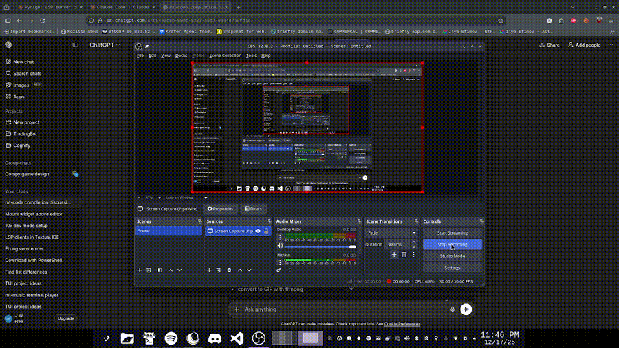

# mt-code

A lightweight terminal-based code editor with LSP support.

## Demo



## Installation

```bash
git clone https://github.com/mystyy01/mt-code.git
cd mt-code
chmod +x install.sh
./install.sh
```

The install script will:
- Create a virtual environment
- Install dependencies
- Add `mt-code` to your PATH
- Launch the editor with a welcome file

## Usage

```bash
mt-code                  # Open editor
mt-code file.py          # Open a specific file
mt-code /path/to/folder  # Open a folder
```

## Keybinds

| Key | Action |
|-----|--------|
| Ctrl+O / Ctrl+N | Open file / New tab |
| Ctrl+S | Save file |
| Ctrl+W | Close tab |
| Ctrl+Q | Quit |
| Shift+Tab | Switch tabs |
| Ctrl+E | Focus editor |
| Ctrl+T | Focus terminal |
| Ctrl+R | Focus file explorer |
| Ctrl+P | Command palette |
| Ctrl+F | Find and replace |
| Ctrl+Space | Trigger autocomplete |
